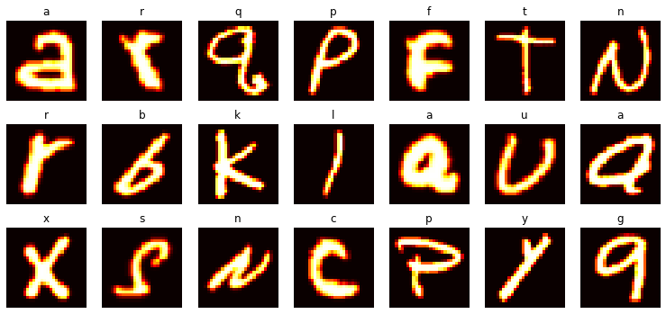

# EMNIST-CNN


Overview
--------
This project involves the use of a Convolutional Neural Network (CNN) to classify handwritten characters in the EMNIST dataset. The EMNIST dataset was gathered using the torchvision library. The CNN architecture includes 3 convolutional layers and 3 fully connected layers. Batch Normalization and Dropout Regularization techniques were applied to both types of layers during the training of the model to improve its performance. The loss and accuracy were measured at each epoch during the training process to evaluate the performance of the model. Finally, the measurements were plotted to visualize the performance of the model. This README file provides an Overview and includes other information related to the project as outlined in the Table of Contents.

Primary Objective
-----------------
To design and implement a Convolutional Neural Network (CNN) that is capable of accurately classifying handwritten characters in the EMNIST dataset. This will be achieved by utilizing the EMNIST dataset gathered through the torchvision library.

Results
-------
Since the dataset was balanced accuracy score was used as the performance measure. On application of Batch Normalization and Dropout Regularization, the trained model was able to achieve a test accuracy of 95.11%.

Usage
-----
If you are looking for a trained model for Transfer Learning or to be able classify the EMNIST images right off the bat, the models folder has a trained CNN called 'EMNISTNet.pt'.

Setup
-----
**prerequisites**
- Google account
- GitHub account
- Git Bash (for Windows)
- Basic understanding of Git and GitHub

If you would like to train a CNN yourself, I recommend [Google Colab](https://colab.research.google.com/). This section provides step by step instructions on establishing connection with GitHub using SSH protocol.
<br><br>
Why is this necessary?<br>Training Deep Learning models are computationally intensive, consequently people utilize GPUs in addition to CPUs for faster execution of the task. If you do not have household GPUs, you can make use of resources provided by cloud services like Google Colab, AWS, Azure or others. That said, there are limitations to the usage of these resources. You can find out more about Google Colab through the link provided above.
<br>
<br>
Let's kick things off by breifly describing the procedure.
The Idea is to setup local repository on your Google Drive, mount the Google Drive on Colab and then use SSH protocol to interact with a remote repository (GitHub).
To do this you need a Secure Shell (SSH) key pair. This key pair has a public and a private key. The key pair can be generated using Git Bash (for Windows) or Terminal (Mac or Linux) or even on Google Colab's code cells with a '!' sign preceeding commands. The private key is then stored on your Google Drive and the public key on GitHub. The next step is to add the private key to an SSH agent. SSH agents provide a secure and efficient way to manage and use SSH keys for remote authentication.

1. **Generating SSH key pair**<br>
On your computer open Git Bash or Terminal and then type the following command.<br>
`ssh-keygen -t rsa -b 4096 -C "email@example.com"` and press Enter.<br>
The default location to save the key is in your user directory in .ssh folder and it will be called 'id_rsa', for example `/Users/shrey/.ssh/id_rsa`, you can leave it as it is or change 'id_rsa' to 'colabkey', for example: `/Users/shrey/.ssh/colabkey` (Note: This demonstration uses the name 'colabkey'). In the next substep you can optionally enter a pass phrase for your key or leave it blank (I left it blank). Once you are ready press enter. The key pair is generated and stored in the location specified above. If the key pair is not located in the specified folder, you can search and locate it or repeat the steps by specifying the full path when prompted, for example `/c/Users/shrey/.ssh/colabkey`.
2. **Accessing the keys**<br>
Navigate to the .ssh folder and you should find 'colabkey' and 'colabkey.pub' files. Next type this command<br>
`cat colabkey.pub`. This is will display a long string of characters and numbers. It starts with ssh-rsa and ends with your email. This is your public key and can be shared with others while the 'colabkey' file in this folder is your private key and should be securely kept on your local machine/storage. Copy your public key by highlighting the string.
3. **Adding the public key to GitHub**<br>
On GitHub, go to 'settings' and then go to 'SSH and GPG keys', click on 'New SSH key', give a title for example 'colabkey' and then paste your key in the 'Key' box. Click 'Add SSH key' and confirm with your GitHub password. That's it you have successfully added your public key to GitHub.
4. **Create a New repository on GitHub**<br>
Create a new repository on your GitHub profile, Give a relevant name for the repository (example: EMNIST-CNN), but do not add any files yet, be it README.md, LICENSE or .gitignore. This will complicate the process of establishing connection a bit.
5. **Moving the private key to Google Drive**<br>
- With the help of a file explorer copy the 'colabkey' or both 'colabkey' and 'colabkey.pub' files. 
- Go to your Google Drive and create a new folder called 'ssh_keys' in 'My Drive'. 
- Paste the files here.
- Create a 'config' file in the same folder and include the following content.<br>
```
  #colab account
  Host github.com
    HostName github.com
    User git
    IdentityFile /root/.ssh/colabkey
```
6. **Mounting your Google Drive on Colab**<br>
- On your Google Drive select or create a folder where you want to build more projects like this. You could perhaps name it 'colab_projects' or 'ColabProjects'.
- Create a new folder inside 'colab_projects' and name it exactly the same as the GitHub repository's name to which you want to connect. In this case 'EMNIST-CNN'. Please note that Git repository(s) will be created here; the .git folder will be placed inside 'EMNIST-CNN' and likewise for other projects.
- Please note that the code snippets below can be written on cells of Colab notebook incase you do not have access to the terminal provided for Colab Pro users. Include '!' before the commands if you're using cells to execute the command.
```
from google.colab import drive
drive.mount('/content/drive')
```
7. **Copying the Key(s) to Virtual Machine**<br>
Google Colab uses a Virtual Machine (VM) to provide computing resources for your notebook. We need to move the private key and config file to the Virtual Machine in order to facilitate communication with GitHub. When the runtime is disconnected these files will be erased from the Virtual Machine. The private key facilitates a mathematical proof that only this key could have generated the public key added to GitHub. 
```
# ssh keys were generated earlier. Private and Public keys are stored in 
# 'colabkey' and 'colabkey.pub' files. Additionally a config file is also 
# stored in /content/drive/MyDrive/ssh_keys/ on google drive.

# Remove ssh folder and its contents if already present
!rm -rf /root/.ssh

# Create a directory
!mkdir /root/.ssh

# Copy everything (ssh_key files & config file) from google drive to Virtual Machine.  
!cp /content/drive/MyDrive/ssh_keys/* /root/.ssh

# Set permission
!chmod 700 /root/.ssh 
```
8. **Adding GitHub as known host**<br>
```
# Add the git server as an ssh known host
!touch /root/.ssh/known_hosts

# Trust github  
!ssh-keyscan github.com >> /root/.ssh/known_hosts

# Set permission  
!chmod 644 /root/.ssh/known_hosts 
```
9. **Run an SSH-agent**<br>
```
# Run ssh-agent and add `ssh-add /root/.ssh/colabkey` in the prompt. 
# After this command, optinally check if the key is saved using `ssh-add -l`, 
# then exit the prompt.
!ssh-agent /bin/bash
```
10. **Check Connection with GitHub**<br>
```
!ssh -T git@github.com
```
You may a message like this: "Warning: Permanently added the ECDSA host key for IP address '**.**.***.***' to the list of known hosts.
Hi user-name! You've successfully authenticated, but GitHub does not provide shell access."
11. **Navigate to the project folder**<br>
for example:
```
cd drive/MyDrive/ColabProjects/EMNIST-CNN
```
confirm using `!ls` command in the next cell.
